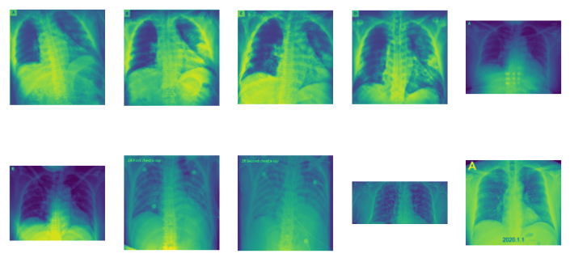

# COVID19-Xray Model

## Description
More and more companies and researchers in China and around the world are rolling out artificial intelligence (AI)-based systems that can process hundreds of computed tomography (CT) images in seconds to speed up diagnosis of COVID-19 and assist in its containment.
This ongoing development was focused on demonstrating that a pre-trained CNN model can be adapted to detect the novel COVID-19 from X-ray and CT images. Thus, for this experiment, a tiny modified version of VGG16 was retrained to predict from an x-ray whether someone has the COVID-19 virus or not; This model was able to predict the disease with a 95% accuracy. However, given the number of images, it could not be enough to use a medical prediction tool. Before this model should undergo a much more thorough evaluation.



## Dataset
The chest X-ray and CT images used to train the model were mainly taken from the public-available dataset https://github.com/ieee8023/covid-chestxray-dataset, where there are 23 images from patients confirmed with the virus, and 73 from people without it. Additionally, 40 extra photos for healthy patients were taken for the Kaggle dataset https://www.kaggle.com/nih-chest-xrays/data, published by  The National Institutes of Health. In total 150 images from each class where used. Both datasets were augmented using the script:
````python
import imgaug as ia
import imgaug.augmenters as iaa
import os
import uuid
def augment_data(images, out_folder):
    ia.seed(1)
    seq=iaa.Sequential([
        iaa.Crop(px=(0,16)),  # crop images from each side by 0 to 16px (randomly chosen)
        iaa.Fliplr(0.5),  # horizontally flip 50% of the images
        iaa.GaussianBlur(sigma=(0,3.0)),  # blur images with a sigma of 0 to 3.0
        iaa.Sharpen(alpha=(0,1.0),lightness=(0.75,1.5))
    ])
    images_aug=seq(images=images)
    os.makedirs(out_folder,exist_ok=True)
    for img in images_aug:
        img=cv2.normalize(img,None,0,255,cv2.NORM_MINMAX,cv2.CV_8U)
        cv2.imwrite(os.path.join(out_folder,"{}.jpg".format(uuid.uuid4())),img)
````

## How to use it??

The model is public-available in GitHub, and can be accessed using torch.hub.

````python
import torch
from PIL import Image
from torchvision import transforms
import numpy as np
try:
    # whether to force a fresh download of github repo unconditionally. Default is False.
    model = torch.hub.load(
            "haruiz/CONV19Xray",
            "conv19", 
            pretrained=True, 
            force_reload =False)

    image_path = r"test_image.jpg"
    input_image=Image.open(image_path)
    input_image = input_image.convert("RGB")
    preprocess=transforms.Compose([
        transforms.Resize(255),
        transforms.CenterCrop(224),
        transforms.ToTensor(),
        transforms.Normalize([0.485,0.456,0.406],[0.229,0.224,0.225])
    ])
    input_tensor=preprocess(input_image)
    input_batch=input_tensor.unsqueeze(0)
    output = model(input_batch)
    _, preds_tensor = torch.max(output, 1)
    top_pred = np.squeeze(preds_tensor.numpy())
    labels_map = {0 : "CONV19", 1: "NORMAL"}    
    print(labels_map[top_pred.item()])# show top class

except  Exception as ex:
    print("Error making predictions : {}".format(ex))
```` 

## How to contribute?
Send a pull request.

# Credits
I would like to extend my thanks and highlight the work of:

- Joseph Paul Cohen: for his valuable contribution sharing the dataset: https://github.com/ieee8023/covid-chestxray-dataset
- National Institutes of Health: for publishing the dataset: https://www.kaggle.com/nih-chest-xrays/data

## Contact
for more information:
- Email: henryruiz22@gmail.com
- LinkedIn:  https://www.linkedin.com/in/haruiz/

